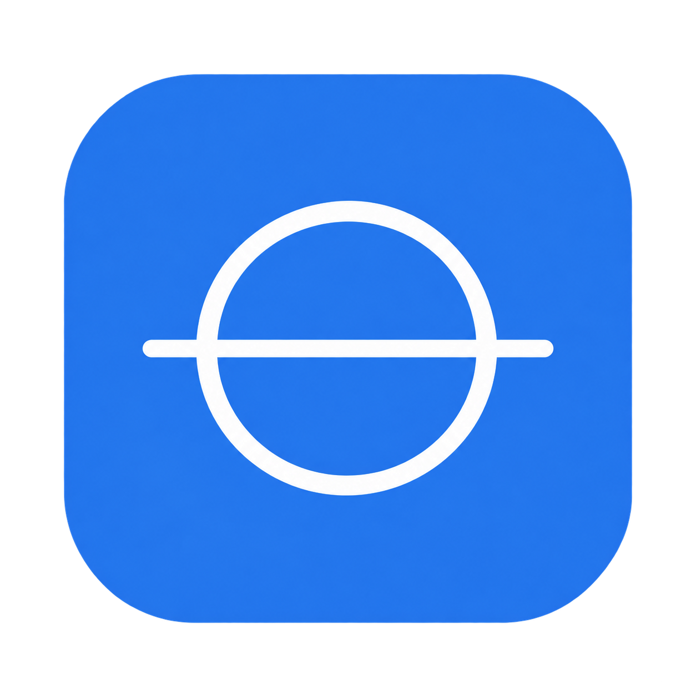
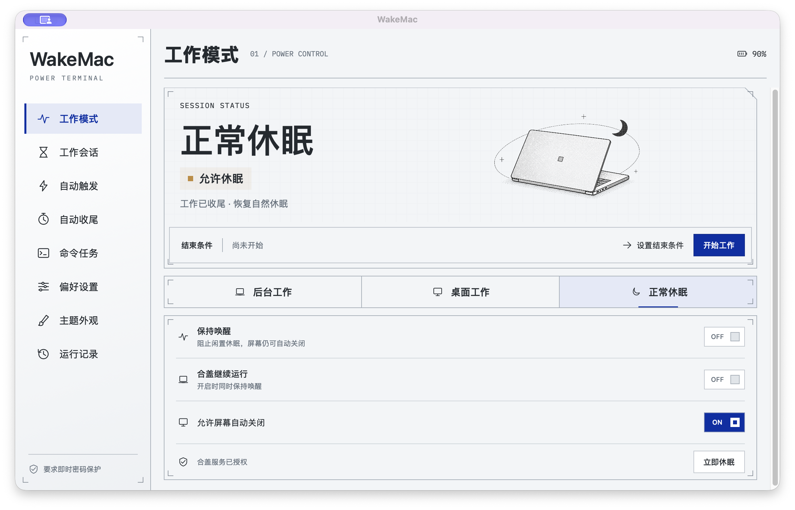

# WakeMac



**让 Mac 保持运行，在工作结束后安心休息。**

[](https://github.com/OrxHsu/WakeMac/releases/latest)
[](https://github.com/OrxHsu/WakeMac/actions/workflows/compatibility.yml)
[](LICENSE)

原生 macOS 菜单栏应用：保持唤醒、合盖运行、按条件结束会话、自动触发及命令完成后休眠。**无需安装 Amphetamine 或 Power Protect**，没有第三方 Swift 库依赖。界面目前为简体中文，采用浅色白银、克莱因蓝与少量橙黄，统一几何图标、控件和动效。



## 下载与安装

**[下载 WakeMac v1.0.0](https://github.com/OrxHsu/WakeMac/releases/tag/v1.0.0)** · [更新记录](CHANGELOG.md)

- 系统：**macOS 15 或更新版本**。
- 芯片：**Apple Silicon（M 系列）**；不支持 Intel 或 macOS 14。
- 下载 `WakeMac-1.0.0-arm64.zip`，解压后把 `WakeMac.app` 移到 `/Applications`，打开应用。
- 发布页同时提供 `SHA256SUMS.txt`；在下载目录执行 `shasum -a 256 -c SHA256SUMS.txt` 可核对压缩包。

本版使用 **Apple Development 签名，未进行 Developer ID 公证**。macOS 可能阻止首次打开；确认下载来源后，可在「系统设置 → 隐私与安全性」查看系统提供的「仍要打开」选项。不同机器上的首次授权及合盖服务安装尚未全面验证；若系统拒绝运行，请提交 Issue，或按下文使用自己的 Apple 开发者证书构建。不要关闭 Gatekeeper 或 SIP。

首次打开会出现在菜单栏。点击菜单栏图标使用快捷面板，或再次打开应用显示主窗口。主窗口默认横向内容尺寸为 1160 × 700，小屏幕会按可用区域调整。

## 三种工作模式

| 模式 | 行为 |
| --- | --- |
| 后台工作 | 保持系统唤醒，合盖继续运行；默认允许屏幕自动关闭。需要启用内置合盖服务。 |
| 桌面工作 | 上盖打开时保持系统唤醒，默认允许屏幕自动关闭；无需管理员权限。 |
| 正常休眠 | 释放 WakeMac 的保活效果和合盖会话，恢复系统正常休眠。不会终止其他应用。 |

主窗口与菜单栏均可直接切换「保持唤醒」和「合盖继续运行」，显示系统实际回读结果。开启合盖运行同时保持唤醒；关闭合盖运行仍保留桌面唤醒；关闭保持唤醒则一并结束合盖运行。

合盖工作请保持设备通风，不要放进包中持续高负载运行。其他应用持有的保活断言仍可能阻止正常模式下的闲置睡眠。

## 功能

- **工作会话**：无限期、指定时长或结束时间、等待应用／后台进程退出、等待所选下载文件完成；支持延长会话。条件满足后结束保活，不关闭应用或终止进程。
- **会话效果**：显示器保持唤醒、延后屏保、解锁期间轻移鼠标、所选磁盘目录定期访问，以及可配置的闲置行为。
- **自动触发**：应用、电源、电量、显示器、USB、蓝牙、音频输出、磁盘、网络、CPU、闲置和每周时间表等；支持全部／任一条件组合。未知状态不会匹配，新规则默认关闭。
- **自动收尾**：定时恢复正常模式、低电量提醒和休眠保护。默认低电量阈值 20%，请求休眠前提供 60 秒取消时间并再次核对电源状态。
- **命令任务**：浅色终端式多行 zsh 编辑区，命令成功后倒计时 60 秒再请求休眠；失败保留现场、记录并通知。只跟踪这里启动的命令，不推断其他任务是否完成。
- **日常控制**：可配置全局快捷键、登录启动、系统通知及提示音、菜单栏图标和时间显示、主题外观、本机统计与最近 200 条运行记录。
- **AppleScript**：开始／结束／延长会话、查询状态、控制显示器／屏保／合盖／触发规则／磁盘保活。

完整对应关系、行为限制和已验证范围见 **[FEATURES.md](FEATURES.md)**。

Safari 下载监测用于大文件下载时保持运行：手动选择下载文件或 `.download` 包，WakeMac 观察增长、完成重命名和稳定时长。不读取浏览记录或 Safari 私有元数据，不接管下载；暂停可能被判断为稳定，重要传输可选择手动结束。

## 合盖服务与权限

1. 将发布的签名应用放进 `/Applications` 并打开。
2. 在「工作模式」或菜单栏面板点「启用合盖服务…」。
3. 在「系统设置 → 通用 → 登录项与扩展」批准 WakeMac 的后台服务；系统可能要求管理员认证。
4. 返回 WakeMac，选择「后台工作」。

服务通过 `SMAppService` 登记，主程序与辅助程序必须使用同一 Apple 开发者证书签名。服务只执行固定的电源控制，不接受任意命令或路径，不修改 sudoers。有效租约下会处理合盖期间的电池／接电切换；断线、超时或退出时释放自己的会话。移除服务前先恢复正常休眠。

**锁屏策略可配置，默认要求即时密码保护。** 也可选择跟随 macOS 已有的密码要求。系统设置及认证由用户本人完成；WakeMac 不更改密码要求、不读取或保存登录密码、不自动解锁已锁定的 Mac。桌面工作不需要管理员授权；轻移鼠标、网络或蓝牙相关功能仅在用户启用时请求对应权限。

合盖控制使用系统的 `SleepDisabled` 开关；`disablesleep` 并非 Apple 文档保证长期兼容的公开参数。每次切换都会核验，失败不会显示为已启用。电源切换后的恢复窗口无法区分系统重置与其他程序同期关闭，需要停止保活时请在 WakeMac 结束工作。

## 命令与数据

使用非交互的前台 zsh 命令，避免 `&`、`nohup` 或需要密码输入的命令。退出时若命令仍在运行，应用会提示等待，不会静默丢弃任务。重新打开默认恢复正常模式，不重放旧命令、下载或倒计时；可显式配置启动／唤醒后开始一个新会话。

偏好、记录和命令日志保存在本机，不上传。命令输出日志最多保存前 5 MB，可能包含敏感输出，请在分享 Issue 前检查。为保留升级数据，内部 bundle ID `local.orx.WorkModes` 与 `~/Library/Application Support/WorkModes/` 目录继续使用旧名称。

```applescript
tell application "WakeMac"
    start session mode "desktop" for minutes 30
    session status
    extend session for minutes 15
    end session
end tell
```

`mode` 支持 `desktop` 和 `background`；省略 `for minutes` 为无限期。完整术语见 [WakeMac.sdef](Resources/WakeMac.sdef)。

## 从源码构建

需要 Xcode 26+（macOS 26 SDK）与 Swift 6 工具链，在 Apple Silicon Mac 上构建。

```sh
git clone https://github.com/OrxHsu/WakeMac.git
cd WakeMac
git checkout v1.0.0
swift test --scratch-path /tmp/wakemac-test-build
./scripts/build-app.sh
```

产物为 `/tmp/wakemac-dist/WakeMac.app`。默认 ad hoc 签名可使用桌面工作等无需合盖服务的功能。合盖服务需要自己的 Apple Development 或 Developer ID 证书：

```sh
WAKEMAC_SIGN_IDENTITY='你的签名证书名称或 SHA-1' ./scripts/build-app.sh
```

`WAKEMAC_BUILD_DIR` 与 `WAKEMAC_OUTPUT_DIR` 可覆盖构建和输出目录。构建及测试产物请放在仓库之外。GitHub Actions 在 ARM64 macOS 15 与 26 上执行测试和 ad hoc Release 构建；云端构建不能证明真实合盖或外接设备行为。

## 反馈与贡献

遇到问题请提交 **[Issue](https://github.com/OrxHsu/WakeMac/issues/new/choose)**，附系统版本、芯片、WakeMac 版本、复现步骤和预期／实际结果。外接设备、可移动磁盘及 Cisco 客户端由具体报告驱动兼容性修复，不宣称全部设备已实测。

[贡献指南](CONTRIBUTING.md) · [行为准则](CODE_OF_CONDUCT.md) · [安全问题报告](SECURITY.md)

## License

[MIT](LICENSE)。随包字体使用独立的 [SIL Open Font License](Assets/Licenses/README.md)。
